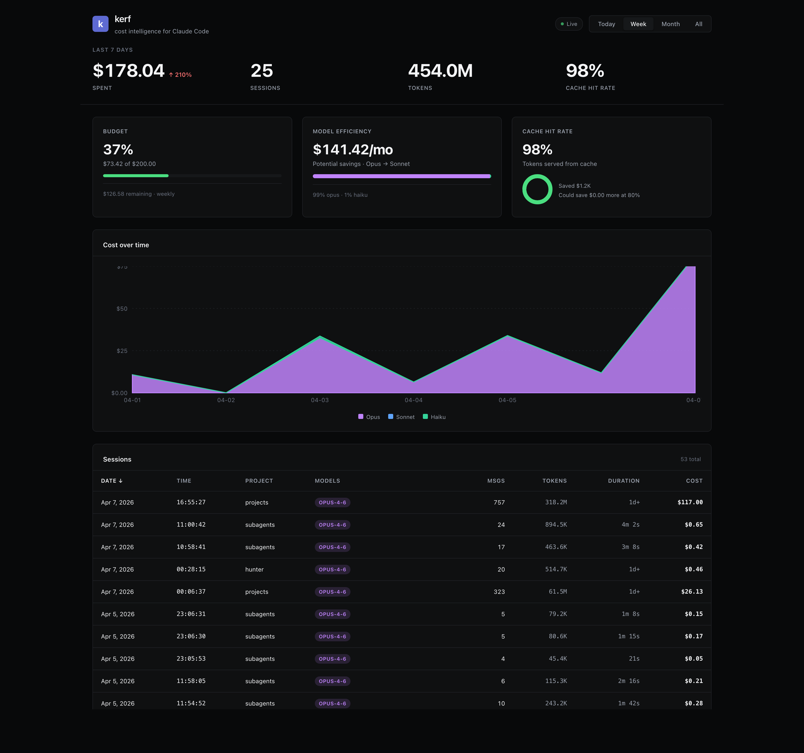

# kerf-cli

**The missing cost intelligence layer for Claude Code.**

> *kerf (n.) — the width of material removed by a cutting tool. Every token operation has a kerf.*

[](https://www.npmjs.com/package/kerf-cli)
[](https://github.com/dhanushkumarsivaji/kerf-cli/actions/workflows/ci.yml)
[](LICENSE)
[]()



> Real screenshot from my own machine — `$178.04 spent in the last 7 days, 25 sessions, 98% cache hit rate, 37% of weekly budget used, $141/mo Opus → Sonnet savings`. Your numbers will look different.

Kerf reads your Claude Code sessions into a local SQLite database you can query with SQL. It surfaces wasted Opus spend, tracks cache hit rate, enforces budgets via Claude Code hooks, and ships a polished local web dashboard.

**100% local. No API keys. No telemetry. No cloud.**

---

## Install

```bash
npm install -g kerf-cli
```

Or use without installing:

```bash
npx kerf-cli@latest <command>
```

Both `kerf` and `kerf-cli` work as command names after a global install.

---

## 60-second tour

```bash
kerf init          # one-time setup (creates DB, installs hooks)
kerf sync          # import your Claude Code sessions into SQLite
kerf summary       # what did I spend today?
kerf efficiency    # am I wasting money on Opus?
kerf dashboard     # open the polished web UI
```

That's the whole tool in 5 commands. The rest is detail.

---

## The dashboard

```bash
kerf dashboard
```

Opens a polished local web UI at `http://localhost:3847`.

- **Hero metrics** — cost, sessions, tokens, cache hit rate, with trend arrows vs prior period
- **Budget card** — progress bar, remaining amount, reset timer
- **Efficiency card** — potential monthly savings if Opus traffic were routed to Sonnet
- **Cache card** — hit rate donut chart, money saved from cache
- **Cost chart** — stacked area chart broken down by Opus/Sonnet/Haiku
- **Session table** — click any row to expand full details
- **Period picker** — today / week / month / all
- **Live indicator** — auto-refreshes every 5 seconds
- **Linear-inspired dark theme**

Loads in <100ms even with thousands of sessions (queries SQLite directly).

---

## Commands reference

### Setup

#### `kerf init`

First-time setup. Creates `~/.kerf/`, initializes the SQLite database, detects compatible tools, and optionally installs Claude Code hooks.

```bash
kerf init                      # warning-mode hooks (default, safe)
kerf init --enforce-budgets    # also install PreToolUse hook that BLOCKS over budget
kerf init --global             # install hooks in ~/.claude/ (applies to all projects)
kerf init --no-hooks           # just create the database, skip hooks
kerf init --hooks-only         # just install hooks, skip database setup
```

#### `kerf doctor`

Diagnose your setup. Checks 10 things and tells you how to fix each one.

```bash
kerf doctor                    # human-readable checklist
kerf doctor --json             # machine-readable
```

Example output:
```
[OK]   Claude Code installed: /Users/you/.claude
[OK]   Claude projects directory has 53 JSONL files
[OK]   kerf database at /Users/you/.kerf/kerf.db
[OK]   Database schema up to date (v3)
[WARN] No budgets configured
       Fix: kerf budget set 50 --period weekly
```

#### `kerf sync`

Ingests Claude Code session JSONL files into the SQLite analytics database. Incremental — only processes files that have changed since the last sync.

```bash
kerf sync                      # ingest everything
kerf sync --json               # machine-readable stats
```

---

### Analytics

#### `kerf summary`

The bread-and-butter command. What did I spend?

```bash
kerf summary                       # today
kerf summary --period week         # last 7 days
kerf summary --period month        # last 30 days
kerf summary --period all          # everything

kerf summary --model               # per-model breakdown
kerf summary --by-project          # per-project breakdown
kerf summary --model --by-project  # both

kerf summary --project ~/code/app  # filter to one project
kerf summary --no-sync             # skip auto-sync (faster)

kerf summary --json                # JSON output
kerf summary --csv                 # CSV output
```

Example:
```
  kerf summary — today

  Cost:      $26.39
  Messages:  146
  Sessions:  5
  Input:     186
  Output:    107.6K
  Cache rd:  60.9M
  Cache wr:  1.7M
```

#### `kerf sessions`

List individual sessions or drill into one.

```bash
kerf sessions                      # 20 most recent
kerf sessions --limit 50           # show more
kerf sessions --sort cost          # most expensive first
kerf sessions --sort messages      # longest sessions
kerf sessions --sort duration      # longest duration
kerf sessions --since 2026-04-01   # after a date
kerf sessions --project ~/code/app # filter by project
kerf sessions --json

kerf sessions fa775f86             # drill into one session (partial ID match)
```

#### `kerf efficiency`

Model usage analyzer. Shows how much you'd save if unnecessary Opus traffic were routed to Sonnet.

```bash
kerf efficiency                      # last 30 days
kerf efficiency --period week
kerf efficiency --period month
kerf efficiency --project ~/code/app
kerf efficiency --expensive-sessions # top 10 expensive sessions
kerf efficiency --json
```

Example:
```
  kerf efficiency report  (month)

  Estimated savings: $144.55 (72.0% of spend)
  if Opus traffic were routed to Sonnet for this month.

  Total spend: $200.69

  Model breakdown:
    opus       $180.69 (90.0% — 2569 msgs, 30 sessions) ##############################
    sonnet      $13.22 (6.6% — 365 msgs, 3 sessions) ##
    haiku        $6.78 (3.4% — 239 msgs, 21 sessions) #
```

**Run this weekly.** If your Opus share is over 50%, you're leaving money on the table.

#### `kerf cache`

Cache hit rate analysis across all your sessions.

```bash
kerf cache                      # last 30 days
kerf cache --period week
kerf cache --project ~/code/app
kerf cache --poor-sessions      # sessions with bad cache utilization
kerf cache --json
```

Example:
```
  kerf cache report  (month)

  Cache hit rate: 100.0%  (426.7M read / 426.8M cacheable)

  Cost:
    Cache read cost:    $128.02
    Saved by cache:    $1152.17
    Could still save:     $0.00 (at 80% hit rate)
```

#### `kerf query`

Read-only SQL escape hatch. Run arbitrary SQL against the analytics database.

```bash
kerf query --schema                # print the schema
kerf query --examples              # 5 useful example queries
kerf query --file query.sql        # run SQL from a file

kerf query "SELECT model, SUM(cost_usd) FROM messages GROUP BY model"

kerf query --json "SELECT * FROM sessions_meta LIMIT 5"
kerf query --csv "SELECT date(timestamp), SUM(cost_usd) FROM messages GROUP BY 1"
```

**Safety:** kerf rejects INSERT, UPDATE, DELETE, DROP, ALTER, CREATE, ATTACH, PRAGMA, REPLACE, TRUNCATE. Your data is safe from typos.

**Useful queries to memorize:**

```sql
-- Top 10 most expensive projects, all time
SELECT project_path, ROUND(SUM(cost_usd), 2) as cost
FROM messages
GROUP BY project_path
ORDER BY cost DESC LIMIT 10;

-- Daily spend, last 30 days
SELECT date(timestamp) as day, ROUND(SUM(cost_usd), 2) as cost
FROM messages
WHERE timestamp > date('now', '-30 days')
GROUP BY day ORDER BY day DESC;

-- Sessions over $5
SELECT session_id, project_path, total_cost_usd, message_count
FROM sessions_meta
WHERE total_cost_usd > 5
ORDER BY total_cost_usd DESC;
```

#### `kerf report`

Historical reports with hourly bar charts and anomaly alerts.

```bash
kerf report                     # today
kerf report --period week
kerf report --period month
kerf report --sessions          # per-session breakdown
kerf report --model             # per-model breakdown
kerf report --sessions --model  # both
kerf report --csv               # CSV export
kerf report --json
```

#### `kerf import`

Sync historical data into the budget tracking tables (separate from the analytics `sync`).

```bash
kerf import                        # import all sessions
kerf import --since 2026-03-01     # only recent data
kerf import --dry-run              # preview without writing
```

---

### Live monitoring

#### `kerf watch`

Real-time terminal dashboard for your active Claude Code session. Run in a second terminal tab while Claude Code is running.

```bash
kerf watch                       # auto-finds active session
kerf watch --session abc123      # specific session
kerf watch --interval 5000       # slower refresh
kerf watch --project ~/code/app  # filter
```

Shows: cost meter, context bar, cache health (HEALTHY/DEGRADED/BROKEN), anomaly alerts, recent messages with per-turn cache ratio.

Press `q` to quit, `b` to toggle budget view.

#### `kerf dashboard`

Opens the polished web dashboard in your browser.

```bash
kerf dashboard              # http://localhost:3847
kerf dashboard --port 8080  # custom port
kerf dashboard --no-open    # don't auto-open browser
```

#### `kerf estimate`

Pre-flight cost estimation. Know what a task will cost before you start.

```bash
kerf estimate "fix typo in README"
kerf estimate "refactor the auth module"
kerf estimate "build a complete dashboard from scratch"

kerf estimate --compare "add feature"       # sonnet vs opus vs haiku table
kerf estimate --model opus "complex task"   # specific model
kerf estimate --files 'src/auth/*.ts' "add OAuth"  # with file context
kerf estimate --precise "refactor parser"   # uses Anthropic API (needs ANTHROPIC_API_KEY)
kerf estimate --json "fix bug"
```

Example compare output:
```
  kerf-cli estimate: 'add feature'

  Model      Turns          Low          Expected     High
  ----------------------------------------------------------
  sonnet     5-15           $0.67        $1.05        $1.45
  opus       5-15           $3.35        $5.24        $7.26
  haiku      5-15           $0.18        $0.28        $0.39

  Cheapest: haiku at $0.28
  Priciest: opus at $5.24
```

---

### Budgets & enforcement

#### `kerf budget`

Set spending limits per project.

```bash
kerf budget set 50 --period weekly   # set budget
kerf budget set 10 --period daily
kerf budget set 200 --period monthly

kerf budget show                      # current project budget
kerf budget show --json
kerf budget list                      # all projects with budgets
kerf budget remove                    # remove current budget

kerf budget check                     # exit code 0 if under, 2 if over (for hooks)
kerf budget check --json
```

Example:
```
  kerf budget

  Period:  weekly (2026-04-07 to 2026-04-13)
  Budget:  $50.00
  Spent:   $42.30
  [████████████████░░░░] 84.6%
```

#### Two enforcement modes

**Warning mode (default):**
```bash
kerf init   # installs Notification + Stop hooks
```
You get warnings at 80% and alerts at 100% but Claude Code keeps running.

**Blocking mode (opt-in):**
```bash
kerf init --enforce-budgets
```
Also installs a PreToolUse hook that returns exit code 2 to Claude Code when over budget. Claude Code physically stops the tool call.

---

### Optimization

#### `kerf audit`

Find invisible token waste eating your 200K context window.

```bash
kerf audit                      # full audit
kerf audit --claude-md-only     # per-section CLAUDE.md analysis
kerf audit --mcp-only           # MCP server analysis
kerf audit --fix                # auto-reorder CLAUDE.md for optimal attention
kerf audit --json
```

Example:
```
  kerf-cli audit report

  Context Window Health: B (69% usable)

  Ghost Token Breakdown:
    System prompt:         14,328 tokens (7.2%)
    Built-in tools:        15,000 tokens (7.5%)
    MCP tools (0 srv):          0 tokens (0.0%)
    CLAUDE.md:                427 tokens (0.2%)
    Autocompact buffer:    33,000 tokens (16.5%)
    ----------------------------------------
    Total overhead:        62,755 tokens (31.4%)
    Effective window:     137,245 tokens (68.6%)
```

**Grades:** A (>70% usable) · B (50-70%) · C (30-50%) · D (<30%)

**The CLAUDE.md attention curve:** Claude's attention is U-shaped. Rules at the top (0-30%) and bottom (70-100%) of the file get high attention. The middle 30-70% is a "dead zone." Run `kerf audit --fix` to auto-reorder critical rules (NEVER, ALWAYS, MUST) out of the dead zone. It creates a `.kerf-backup` first.

---

## All commands at a glance

| Command | What it does |
|---------|-------------|
| `kerf init` | First-time setup |
| `kerf init --enforce-budgets` | Setup + blocking PreToolUse hook |
| `kerf doctor` | Diagnose setup issues |
| `kerf sync` | Ingest Claude Code sessions into SQLite |
| `kerf summary` | Cost summary |
| `kerf sessions` | List/inspect sessions |
| `kerf efficiency` | Model usage analyzer |
| `kerf cache` | Cache hit rate analysis |
| `kerf query "<sql>"` | Read-only SQL escape hatch |
| `kerf report` | Historical reports |
| `kerf import` | Budget data import |
| `kerf watch` | Live terminal dashboard |
| `kerf dashboard` | Web dashboard (localhost:3847) |
| `kerf estimate <task>` | Pre-flight cost estimation |
| `kerf estimate --compare <task>` | Compare Sonnet vs Opus vs Haiku |
| `kerf budget set <amt> --period <p>` | Set project budget |
| `kerf budget show / list / remove / check` | Budget management |
| `kerf audit` | Ghost token + CLAUDE.md audit |
| `kerf audit --fix` | Auto-reorder CLAUDE.md |

Global flags on most commands: `--json`, `--csv`, `--period <today|week|month|all>`, `--project <path>`.

---

## Recommended workflow

**Daily (30 sec):**
```bash
kerf summary --by-project
```

**Weekly (2 min):**
```bash
kerf summary --period week
kerf efficiency
kerf cache
```

**Before a big task:**
```bash
kerf estimate --compare "what I'm about to do"
kerf budget show
```

**When something looks wrong:**
```bash
kerf doctor
kerf audit
```

**When you want a custom view:**
```bash
kerf query "SELECT ... FROM messages WHERE ..."
```

**When you want visuals:**
```bash
kerf dashboard
```

---

## How kerf works

```
Claude Code session
       ↓ writes JSONL
~/.claude/projects/<encoded-path>/<session>.jsonl
       ↓ kerf sync (or auto on open)
~/.kerf/kerf.db (SQLite)
       ↓
┌──────────────┬──────────────┬─────────────┐
↓              ↓              ↓             ↓
CLI commands   Web dashboard  SQL queries   Hooks (live)
```

Kerf reads Claude Code's native JSONL session logs (they're already being written — kerf doesn't change how Claude Code works) and imports them into a local SQLite database. All subsequent queries hit SQLite, which is why they're fast.

For live monitoring, kerf installs optional hooks that run during Claude Code sessions: a Notification hook logs every message, a Stop hook enforces budget warnings, and (opt-in) a PreToolUse hook blocks tool calls when over budget.

---

## Privacy

- **Local-only.** Data never leaves your machine. No telemetry. No network calls except for the optional `--precise` flag which uses Anthropic's free `count_tokens` API.
- **No API key required** for the core features.
- **No cloud.** Your `~/.kerf/kerf.db` is yours — inspect it with `sqlite3`, back it up, delete it, wipe it at any time.
- **Open source, MIT licensed.** Read the code, audit it, fork it.

---

## Files & paths

```
~/.claude/projects/                  # Claude Code's session JSONLs (kerf reads from here)
~/.claude/settings.json              # Hooks live here after `kerf init`
~/.kerf/
├── kerf.db                          # SQLite database (analytics + budgets)
├── session-log.jsonl                # Hook event log
└── hooks/
    ├── notification.sh
    ├── stop.sh
    └── pretool.sh                   # Only if --enforce-budgets
```

---

## Why not ccusage?

ccusage is a great quick cost reporter. Kerf is what you reach for when you need:

- A queryable analytics layer — `kerf query "SELECT ..."`
- Real budget enforcement — blocks Claude Code via hooks, not just warns
- Cost-per-project attribution
- Model efficiency analysis with concrete $ savings
- Cache hit rate visibility
- A polished web dashboard
- Long-term history beyond Claude Code's 30-day log deletion

They complement each other. Use ccusage for a quick check, kerf when you need to actually do something about your spend.

---

## Learn more

- [CHANGELOG.md](CHANGELOG.md) — version history
- [ARCHITECTURE.md](ARCHITECTURE.md) — project structure and design decisions

---

## Contributing

```bash
git clone https://github.com/dhanushkumarsivaji/kerf-cli.git
cd kerf-cli
npm install
npm test
```

Issues and PRs welcome. Please open an issue first for any large changes.

---

## License

[MIT](LICENSE) — Dhanush Kumar Sivaji
